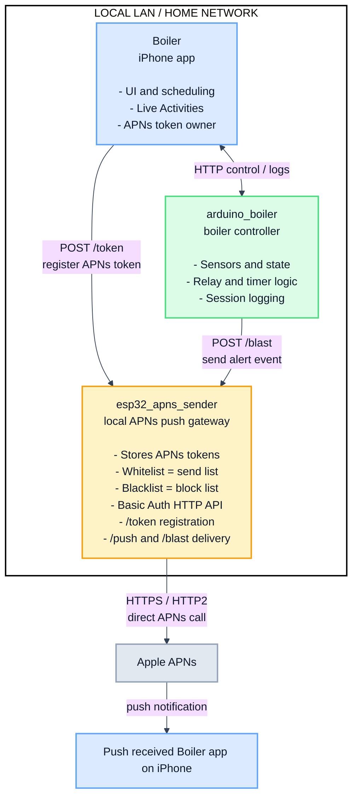

# ESP32 APNs Sender

An ESP32 firmware project that connects to Wi-Fi, starts a local HTTP API, and sends Apple Push Notifications directly to APNs without a separate cloud relay.

This project is aimed at LAN-based IoT deployments where the device itself is already the event source and can also act as the push gateway. Instead of sending alerts to a remote backend first, the ESP32 can call Apple directly and notify iPhone clients with very little infrastructure.

## What It Provides

- Direct APNs delivery from the ESP32 using Apple's HTTP/2 API
- Token-based APNs authentication using a `.p8` key, Team ID, and Key ID
- Local REST API for:
  - sending a push to one device
  - broadcasting the same push to all registered devices
  - registering, listing, deleting, whitelisting, and blacklisting device tokens
- Persistent token storage in NVS, so device mappings survive reboot
- Separate sandbox and production token namespaces
- Token access control with:
  - send list as the whitelist
  - block list as the blacklist
- Basic Auth protection on all HTTP endpoints
- Background push tasks with a concurrency cap for single-send requests
- Automatic removal of unregistered tokens during broadcast failures

## Why The Push Server Runs On The IoT Device

This firmware is built around the idea that the IoT device is already the thing that knows an event happened.

Serving the push API on the ESP32 itself gives you:

- Lower latency: the device can notify iOS clients immediately after a sensor event, relay trigger, or local automation decision
- No mandatory cloud backend: no VPS, webhook worker, Firebase relay, or custom middle tier is required just to deliver a push
- Better local autonomy: pushes can still be initiated by the device as long as it has internet access to APNs, even if your own backend is offline
- Simpler architecture for LAN projects: the same box can host the local control endpoint, hold device-token state, and send alerts
- Lower operating cost and power footprint than keeping an always-on general-purpose server around for lightweight notification tasks

The tradeoff is security and operational hardening. This device stores notification credentials, exposes an HTTP API, and is resource-constrained, so it should be treated as a trusted LAN component rather than a public internet service.

## How It Works

1. The ESP32 boots and initializes NVS.
2. It connects to Wi-Fi in station mode.
3. It syncs time using SNTP, because APNs JWT authentication requires a valid timestamp.
4. It loads APNs configuration from `menuconfig` and embeds the `.p8` key from `main/certs/apns_auth_key.p8`.
5. It starts an HTTP server.
6. API clients call the ESP32 over the local network.
7. The ESP32 generates an ES256 JWT and opens an HTTP/2 TLS connection to Apple.
8. APNs delivers the notification to the iOS app identified by your bundle ID.

## Current Implemented Features

### APNs Client

- Uses APNs token authentication, not certificate auth
- Generates ES256 JWTs locally with mbedTLS
- Reuses JWTs for about 55 minutes to avoid excessive provider-token refreshes
- Connects to:
  - `api.sandbox.push.apple.com`
  - `api.push.apple.com`
- Verifies TLS using ESP-IDF's certificate bundle

### Local API Server

- Runs an HTTP server on the ESP32
- Requires HTTP Basic Auth on every endpoint
- Supports:
  - `POST /push`
  - `POST /blast`
  - `POST /token`
  - `GET /tokens/send`
  - `DELETE /tokens/send`
  - `GET /tokens/block`
  - `POST /tokens/block`
  - `DELETE /tokens/block`
  - `POST /tokens/move-to-block`
  - `POST /tokens/move-to-send`

### Token Registry

- Stores device tokens in NVS flash
- Keys entries by IPv4 address string
- Keeps separate send/block lists
- Treats the send list as a whitelist of devices allowed to receive broadcasts
- Treats the block list as a blacklist of devices whose registration or delivery is suppressed
- Keeps separate sandbox/production namespaces
- Preserves entries across reboots

## Important Behavioral Notes

- The token store assumes device IP addresses are stable enough to be used as identifiers.
- `POST /push` is queued into a background FreeRTOS task and limited to 3 concurrent sends.
- `POST /blast` also runs in the background, but it sends to registered devices one-by-one within that task.
- If APNs reports a token as unregistered during broadcast, that token is removed from the send list.
- Token registration is ignored when that device IP is already blacklisted for the selected `server_type`.
- Devices can be moved between the whitelist and blacklist using the token-management endpoints.
- The API accepts a `custom_payload` field, but the current APNs payload builder only sends `aps.alert`, optional `badge`, and optional `sound`.
- The HTTP API is plain HTTP, not HTTPS.

## Requirements

- ESP-IDF 5.x
- An ESP32 target with enough memory for TLS + HTTP/2
- Wi-Fi connectivity
- Internet access from the device to Apple's APNs servers
- Apple Developer account
- APNs authentication key (`.p8`)
- iOS app bundle ID that matches your APNs topic

## IDE / Development Environment

This project does not depend on one specific IDE. It is a standard ESP-IDF + CMake firmware project, so you can work with it using either the terminal or an editor with ESP-IDF integration.

Recommended options:

- VS Code with the Espressif IDF extension
- CLion with ESP-IDF/CMake configured
- Any code editor plus the `idf.py` command-line workflow

For most developers, VS Code is the easiest choice because it can help with:

- ESP-IDF environment setup
- Menuconfig access
- Build / flash / monitor tasks
- CMake project navigation
- Serial monitor integration

Arduino IDE is not the preferred environment for this project because the firmware is written as a native ESP-IDF application rather than an Arduino sketch. It relies on ESP-IDF project structure, `menuconfig`/`sdkconfig`, component-based CMake builds, FreeRTOS task control, the ESP-IDF HTTP server, NVS, SNTP, TLS certificate bundle support, and direct APNs/HTTP/2 integration. Those pieces fit naturally in ESP-IDF tooling, but they are less convenient to manage from the Arduino IDE.

## Configuration

Configure the project in `idf.py menuconfig` under `APNs Configuration`.

### Wi-Fi Settings

- `CONFIG_APNS_WIFI_SSID`
- `CONFIG_APNS_WIFI_PASSWORD`

### Apple Push Notification Settings

- `CONFIG_APNS_TEAM_ID`
- `CONFIG_APNS_KEY_ID`
- `CONFIG_APNS_BUNDLE_ID`
- `CONFIG_APNS_USE_SANDBOX`

### API Authentication

- `CONFIG_API_AUTH_USER`
- `CONFIG_API_AUTH_PASS`

## Setup

### 1. Place the APNs key

Put your Apple `.p8` key here:

```text
main/certs/apns_auth_key.p8
```

The firmware embeds this file at build time.

### 2. Build and flash

```bash
idf.py menuconfig
idf.py build
idf.py -p <PORT> flash monitor
```

After boot, the serial log shows the IP address assigned to the ESP32 and confirms when the API server is ready.

## API Overview

All endpoints require HTTP Basic Auth.

Example header:

```http
Authorization: Basic <base64(username:password)>
```

### Send One Push

`POST /push`

```json
{
  "device_token": "YOUR_APNS_DEVICE_TOKEN",
  "title": "Doorbell",
  "body": "Someone is at the gate",
  "badge": 1,
  "sound": "default",
  "server_type": "sandbox"
}
```

Response:

```json
{"status":"queued"}
```

### Broadcast To Registered Devices

`POST /blast`

```json
{
  "title": "Alarm",
  "body": "Water leak detected",
  "sound": "default",
  "server_type": "production"
}
```

Response:

```json
{"status":"queued"}
```

### Register A Token

`POST /token`

```json
{
  "ip": "192.168.1.42",
  "token": "YOUR_APNS_DEVICE_TOKEN",
  "server_type": "sandbox"
}
```

Possible responses:

```json
{"status":"ok"}
```

```json
{"status":"ignored","reason":"blocked"}
```

```json
{"status":"ignored","reason":"no_change"}
```

### Whitelist / Blacklist Management

The firmware keeps two persistent token lists:

- whitelist: the send list used by `/blast`
- blacklist: the block list used to suppress or opt out a device

Available endpoints:

- `GET /tokens/send` to view the whitelist
- `DELETE /tokens/send` to remove a device from the whitelist
- `GET /tokens/block` to view the blacklist
- `POST /tokens/block` to add a device directly to the blacklist
- `DELETE /tokens/block` to remove a device from the blacklist
- `POST /tokens/move-to-block` to move a device from whitelist to blacklist
- `POST /tokens/move-to-send` to move a device from blacklist to whitelist

## Example curl Commands

```bash
ESP_IP=192.168.1.10
AUTH="admin:changeme"

curl -u "$AUTH" -X POST "http://$ESP_IP/token" \
  -H "Content-Type: application/json" \
  -d '{"ip":"192.168.1.42","token":"YOUR_APNS_DEVICE_TOKEN","server_type":"sandbox"}'

curl -u "$AUTH" -X POST "http://$ESP_IP/push" \
  -H "Content-Type: application/json" \
  -d '{"device_token":"YOUR_APNS_DEVICE_TOKEN","title":"Test","body":"Hello from ESP32","server_type":"sandbox"}'

curl -u "$AUTH" -X POST "http://$ESP_IP/blast" \
  -H "Content-Type: application/json" \
  -d '{"title":"Broadcast","body":"Hello everyone","server_type":"sandbox"}'

# List all whitelist / send-list tokens
curl -u "$AUTH" "http://$ESP_IP/tokens/send"

# Delete a token from the whitelist / send list
curl -u "$AUTH" -X DELETE "http://$ESP_IP/tokens/send" \
  -H "Content-Type: application/json" \
  -d '{"ip":"192.168.1.42"}'

# List all blacklist / block-list tokens
curl -u "$AUTH" "http://$ESP_IP/tokens/block"

# Add a token directly to the blacklist / block list
curl -u "$AUTH" -X POST "http://$ESP_IP/tokens/block" \
  -H "Content-Type: application/json" \
  -d '{"ip":"192.168.1.42","token":"YOUR_TOKEN"}'

# Delete a token from the blacklist / block list
curl -u "$AUTH" -X DELETE "http://$ESP_IP/tokens/block" \
  -H "Content-Type: application/json" \
  -d '{"ip":"192.168.1.42"}'

# Move a device from whitelist / send list -> blacklist / block list
curl -u "$AUTH" -X POST "http://$ESP_IP/tokens/move-to-block" \
  -H "Content-Type: application/json" \
  -d '{"ip":"192.168.1.42"}'

# Move a device from blacklist / block list -> whitelist / send list
curl -u "$AUTH" -X POST "http://$ESP_IP/tokens/move-to-send" \
  -H "Content-Type: application/json" \
  -d '{"ip":"192.168.1.42"}'
```

## Architecture Diagram



## Project Layout

```text
main/
  apns.c            APNs client, JWT generation, HTTP/2 send path
  api_server.c      Local REST API with Basic Auth
  token_store.c     NVS-backed send/block token storage
  scan.c            Boot flow, Wi-Fi, SNTP, startup wiring
  Kconfig.projbuild Project config options
  certs/            Place the APNs `.p8` key here
docs/
  API_REFERENCE.md  Endpoint reference
todo/
  *.md              Design notes and follow-up plans
```

## Security Notes

- Do not expose this API directly to the public internet.
- Change the default API password before real deployment.
- The `.p8` key is embedded into the firmware image, so protect build artifacts and devices accordingly.
- Because the API uses HTTP Basic Auth over plain HTTP, it should only run on a trusted network or behind your own secure network boundary.
- This repository is a practical demo for local IoT push workflows, not a hardened production notification appliance.
